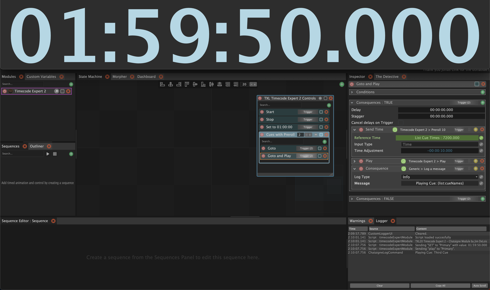

# "TXL20 Timecode Expert 2" - Chataigne Module

## Related Software
This plugin extends Chataigne to control Timecode generation via TXL's Timecode Expert 2 application.

### Chataigne by Ben Kuper
The [Chataigne](https://benjamin.kuperberg.fr/chataigne/en) software serves as a robust, multi-faceted orchestrator of media and media-related software.

### Timecode Expert 2 by TXL
TXL's [Timecode Expert 2](https://txl20.com/timecode-expert-2/) (TE2) is a standalone application that can generate, receive, and route any number of Timecode signals using SMPTE LTC, MTC, Art-Net, and HTTP protocols.

Given that Chataigne excels at show control and Timecode Expert provides flexibile routing for system synchronization, they are a natural fit for one another.

## Module Features

### Basics
The Module requires that a "Generator Name" be specified.  This is the name of the Generator in TE2 that Chataigne will control. To control multiple Generators, add the Module to Chataigne multiple times.&dagger;

The Module provides a few basic commands to send to the Timecode generator, such as "Play", "Pause", and "Stop". It is also possible to toggle the "Clock" button in Timecode Expert 2.

### Setting the Timecode
In addition to using the Time-formatted entry shown in other screenshots and throughout Chataigne, there is also a "Parameterized" set of inputs that make binding the individual segments to other values more straightforward.  All parts of this control accept negative as well as overloaded values. They will be correctly normalized by the Module plugin.

There is a Command to specify a "Reference Time" and then use an offset in order to dynamically set relative times, sub-cues, rehearsal cues, prerolls, etc. This Command also accepts either "Time" or "Parameterized" inputs.

## Module TODO:
- [ ] Unit Testing

---
NOTES:

&dagger; It may be possible in the future to manage multiple generators with one instance of the plugin
